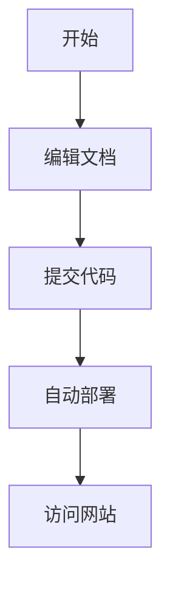

# MkDocs Wiki 测试

欢迎来到MkDocs测试Wiki！

## 🧪 测试功能

这个Wiki用于测试各种MkDocs功能：

### 代码高亮测试
```python
def hello_world():
    print("Hello, MkDocs!")
    return True
```

### 数学公式测试
行内公式：$E = mc^2$

块级公式：
$$
\int_{-\infty}^{\infty} e^{-x^2} dx = \sqrt{\pi}
$$

### Mermaid图表测试


### 警告框测试
!!! info "信息"
    这是一个信息框

!!! warning "警告"
    这是一个警告框

!!! success "成功"
    部署成功！

## 📖 测试内容

- [测试课程简介](test-course/intro/main.md)
- [测试课程笔记](test-course/note/main.md)

## 🚀 部署状态

如果你看到这个页面，说明自动部署成功了！

---

*这是一个测试Wiki，用于验证MkDocs配置*
